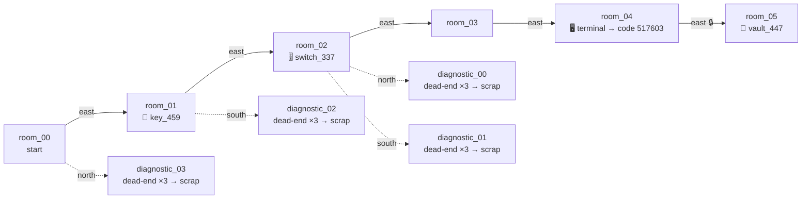
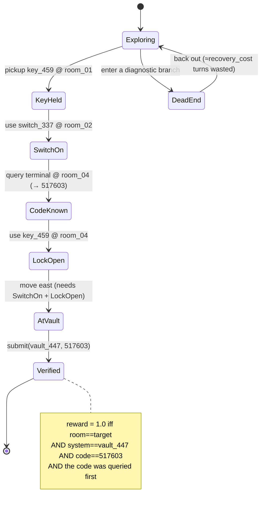

# Chopped Rollouts: When Does Compaction Break GRPO?

**TL;DR.** I built a cheap, exactly-verifiable symbolic tool-calling environment to test one idea: that GRPO struggles against critic-based PPO in long-horizon RL not because of *difficulty*, but because of *rollout structure*. When you compact long rollouts into fixed-token training segments, one rollout becomes four segments and another becomes one — and GRPO's group baseline, which relies on advantages cancelling within a prompt group, stops cancelling. The twist that shaped the whole project: difficulty and segment-imbalance pull in opposite directions, so I stopped tuning the task and started tuning the compactor. All four arms trained to convergence, an offline gradient-SNR analysis confirms the mechanism, and a held-out hard-task eval shows the compaction penalty transfers to generalization — while a from-scratch critic (PPO) is the weakest arm here, not the strongest.

---

## The hypothesis

Two rollouts from the same prompt can look nothing alike. One agent inspects efficiently and solves the room-and-vault puzzle in nine turns; another backtracks, queries dead-end terminals, recovers, and finishes in twenty-two. Compact them into fixed-token segments and the first is one training example, the second is four.

GRPO leans on a group baseline: advantages are mean-centered within a prompt group, so they sum to zero. That zero-sum property *is* the variance reduction. But if rollouts contribute different numbers of segments, and each segment inherits the rollout's advantage, the group no longer sums to zero. PPO doesn't have this problem — a critic scores each segment on its own, so variable segment counts are just variable numbers of independent examples.

So: *does compaction hurt GRPO specifically, and does a critic degrade more gracefully?* That's the question.

## The environment

I needed a benchmark that (a) is exactly verifiable — no LLM-judge noise to contaminate a variance study — (b) produces genuinely heterogeneous trajectory lengths from the *same* prompt, and (c) is cheap enough to sweep. So the environment is a deterministic symbolic state machine, not a code sandbox.

**The world.** Each task is a hidden dependency graph. A main corridor of rooms `room_00 … room_depth` is chained west↔east. The solution is a fixed dependency chain: a `key_###` sits in room 1, a `switch_###` at the midpoint, an access **terminal** holding a 6-digit code one room before the end, and the **target vault** in the last room behind a locked exit. Solving it requires an ordered sequence — explore east, pick up the key, flip the switch, query the terminal for the code, unlock the final exit with the key, read the exact vault identifier, then submit *both* the identifier and the code. Submission is terminal and there's no partial credit.

**The agent loop.** The policy acts through six tools — `symbolic_inspect / _move / _pickup / _use / _query / _submit` — served over an OpenAI-compatible tool-calling API (hermes parser). Every tool response returns the *complete visible state* after the action (current room, exits, `locked_exits`, visible objects, inventory, activated mechanisms, whether an `access_terminal` is present). So the task is a partially-observed graph-traversal-and-ordering problem: the model has to maintain its own map, inventory, and dead-end memory across turns. **Reward is a single exact-match verifier on hidden state** — 1.0 iff the submitted system id and code both match, else 0.0 — which is what makes it a clean substrate for a gradient-variance analysis.

**Where the length heterogeneity comes from.** Two knobs inject branch-and-backtrack without changing the solution path: `distractor_ratio` attaches `diagnostic_*` side-branches (north/south) off corridor rooms, each a dead-end chain of length `recovery_cost` that the agent must recognize and reverse out of; `verbosity`/`imbalance` pad room descriptions with irrelevant diagnostic text. Neither moves the goal, but both make the *number of turns a rollout takes highly policy-dependent* — one rollout walks straight to the vault, another wanders three dead ends. That variance is the raw material the compactor turns into segment-count imbalance.

**A concrete task.** Here is a real medium task from the eval set (`stc-56c8893db64c3c6c`, depth 5, `distractor_ratio=0.4`, `recovery_cost=3`). Solid arrows are the solution corridor; dashed arrows are dead-end distractor branches the agent must back out of:

The reward is an exact function of hidden state, so the task *is* a state machine — the agent has to drive it from `start` to `verified` through an ordered set of gates. The final east exit into the vault is locked until **both** the switch is active **and** the key has been used to release the lock, and a submission only verifies if the code was actually queried from the terminal:

## How tasks are generated

Generation is a pure function of an integer seed (`generate_task(seed, …)` in `generator.py`), so the entire dataset is reproducible and every task gets a content-addressed id (`stc-<sha256(payload)[:16]>`). The horizon bucket picks the corridor depth, and the optimal plan length is always `depth + 5` (the fixed key→switch→terminal→unlock→submit tail):

| bucket | corridor depth | optimal plan len |
|---|---:|---:|
| short | 3 | 8 |
| medium | 5 | 10 |
| long | 8 | 13 |
| xlong | 12 | 17 |
| xxlong | 16 | 21 |

The remaining knobs — `branching_factor` (≤2 side exits), `distractor_ratio` ∈ [0,1], `recovery_cost` (dead-end depth), `verbosity`, `imbalance` — are dialed independently, so I can hold difficulty fixed while varying trajectory-length dispersion, or vice versa. Two properties paid off later: because ids are deterministic and content-addressed, **I could build curricula by *selecting* already-scored tasks from disk at zero GPU cost** (e.g. "keep only groups that were pass@4-mixed"), and any dataset re-generates bit-for-bit for auditing.

## The compactor

Compaction is the object under study, so it's worth stating precisely. A rollout is an alternating sequence of assistant tool-calls and tool responses. The compactor walks the rollout accumulating newly-introduced tokens and cuts a new **segment** whenever the running count would exceed a `token_budget` (`compact_rollout` in `compaction.py`); each segment records its token/turn length, its position bucket (early/middle/late), the carried environment state at its start, and — crucially — the **inherited group advantage** of its parent rollout. So a rollout that took 9 turns might be one segment; a 22-turn rollout at the same budget becomes four, each stamped with the *same* rollout-level advantage. `token_budget` is therefore the single lever that converts trajectory-length variance (from the distractors above) into **segment-count variance** — the exact quantity the four regimes disagree about how to handle.

One design point that's easy to get wrong: **online compaction keeps the original causal prefix and only masks the loss outside the selected segment.** Re-rendering each segment as a fresh standalone prompt would break on-policy semantics, since the behavior logprobs were sampled under the full context. Keeping the real prefix means the tokens we compute gradients on were actually generated under the context we score them in.

Everything runs on `Qwen3-4B-Instruct-2507`, 8×H100 (5 inference / 3 trainer).

## The wall that flipped the plan

The obvious plan — generate hard tasks to get long, many-segment rollouts — died on contact with the frozen-policy pass@4 baselines:

| Dataset | Mean pass | Groups |
|---|---:|---|
| scaled-solvable (long/xlong, low distractor) | 0.6% | 79/80 all-fail |
| scaled-mixed (long/xlong/xxlong, high distractor) | 0.0% | 120/120 all-fail |
| medium-verbose (depth 5–8) | 0.25% | 99/100 all-fail |

The 4B hits a wall at depth 8+, and — worse for me — when a task is too hard the model *bails early* (~11–13 turns). Harder tasks give **shorter, all-fail, zero-signal** rollouts. Difficulty cannot buy you segment imbalance; it buys you the opposite.

## The unlock: tune the compactor, not the task

Segment count isn't a property of the task. It's a property of the compaction `token_budget` — the newly-introduced tokens allowed per segment. So I split the two axes: use a *solvable* set for signal, and use the budget to manufacture imbalance. A CPU-only sweep over saved traces (reward fixed at 0.42, mixed-fraction fixed at 0.89 — same rollouts throughout) shows it cleanly:

| token_budget | seg/rollout | frac. groups with variable segment counts |
|---|---:|---:|
| 2048 (my original configs) | 1.04 | 14% |
| 768 | 2.21 | 63% |
| **384 (chosen)** | **4.02** | **87%** |
| 256 | 5.16 | 97% |

At `384` I get ~4 segments per rollout and 87% of groups carrying real within-group imbalance, with the reward signal untouched. That's the whole experiment in one knob. (I burned some GPU on deep-horizon datagen before noticing the cheapest probe in the project — a re-tokenization sweep — already told me where to look.)

The training curriculum came the same cheap way: 624 tasks, all known pass@4-*mixed*, assembled by selecting mixed groups from scored artifacts. Early trainable fraction ~97–98%, versus ~1–3% on the old saturated set.

## Four regimes, one variable

Everything identical except how compaction credit is assigned: same curriculum, `token_budget=384`, group size 8, val every 10 steps.

1. **Full GRPO** — intact rollouts, no compaction (the control).
2. **Compacted GRPO** — each segment inherits the rollout advantage; more segments ⇒ more total influence.
3. **Segment-normalized GRPO** — same, but divide each rollout's influence by its segment count. *The decisive ablation.*
4. **Compacted PPO** — a value head scores each segment independently.

## Why this stresses GRPO — precisely

GRPO's advantage is mean-centered, so within a group \(\sum_i A_i = 0\). Compact rollout \(i\) into \(S_i\) segments, each inheriting \(A_i\), and its total contribution scales like \(A_i S_i\). Now:

$$\sum_i A_i S_i = \bar S \underbrace{\sum_i A_i}_{0} + \sum_i A_i(S_i-\bar S) = G\cdot \operatorname{Cov}(A, S).$$

The baseline no longer cancels; what's left is the **within-group covariance between advantage and segment count**. That's the bug, stated exactly — and it's why `token_budget=384` (large segment-count variance) is engineered to make it bite.

The ablation reads it off directly. Segment-normalized GRPO divides by \(S_i\), restoring \(\tilde A_i = A_i\) and \(\sum \tilde A_i = 0\):

- If **normalization recovers the gap**, the damage was just overweighting many-segment rollouts — a scalar fix.
- If **it doesn't**, the problem is deeper: a segment inherits a *rollout-level* advantage that's wrong at the *segment* level (an early exploratory chunk and a late decisive chunk get identical credit). No group renormalization fixes a per-segment attribution error — which is exactly where a PPO critic should win.

## Measured, not just derived

Before spending GPU-days, I measured the effect directly. Take one fixed set of collected rollouts (5,734 rollouts / 364 usable mixed-reward groups from the compacted-GRPO run), re-segment them offline at several token budgets, and — under the isotropic-gradient-noise model where every trainable token of a rollout pushes one shared direction — score each objective's group gradient in closed form: its **baseline residual** \(|\sum_i W_i|\) (0 for a mean-zero group), its **alignment** with the true advantage-weighted direction, and its **variance inflation** \(\lVert W\rVert^2/\lVert A\rVert^2\). \(W_i\) is the total weight the objective puts on rollout \(i\): \(A_i\) for full/segment-normalized GRPO, \(A_i S_i\) for compacted GRPO (and the pilot PPO, whose rollout-reward critic can't yet differentiate segments).

The covariance term is real and negative — longer, more-segmented rollouts fail more:

\[\operatorname{corr}(A_i, S_i) \approx -0.28 \text{ to } -0.38.\]

So the baseline stops cancelling, and it gets monotonically worse the harder you compact (smaller budget → more segments):

| token budget | seg/rollout | baseline bias | variance inflation | grad SNR (compacted) | grad SNR (full/seg-norm) |
|---:|---:|---:|---:|---:|---:|
| 768 | 3.6 | 0.68 | 16× | 4.80 | 5.7 |
| 512 | 4.8 | 0.93 | 29× | 4.67 | 5.7 |
| 384 | 6.0 | 1.20 | 46× | 4.56 | 5.7 |
| 256 | 8.9 | 1.66 | 99× | 4.46 | 5.7 |

Two things fall out. (1) **Segment-normalized GRPO and the ideal per-segment critic both sit exactly on the clean line** — bias 0, inflation 1×, SNR ~5.7 — confirming the fix is a scalar renormalization, not a mirage. (2) The compacted gradient's *direction* stays ~99% aligned (within-group segment-count CV is only ~0.14, since same-task rollouts have similar length), so the damage here is dominated by a **broken, advantage-correlated baseline and a 16–99× effective-LR blow-up**, not by pointing the wrong way. That's an honest, sharper claim than "GRPO breaks": on this task family compaction mostly *destabilizes* GRPO's gradient scale rather than its aim — and segment normalization removes it exactly.

Per-objective, at the chosen `token_budget=384` (same 364 mixed groups, isotropic model; `align cos`=1.0 is a perfectly advantage-aligned gradient, `bias`=baseline residual, `var infl`=second-moment blow-up, `MC SNR`=bootstrap gradient SNR):

| objective | align cos | bias | var infl | MC SNR |
|---|---:|---:|---:|---:|
| Full GRPO | 1.000 | 0.00 | 1.0× | 5.65 |
| Segment-normalized GRPO | 1.000 | 0.00 | 1.0× | 5.53 |
| Compacted GRPO | 0.992 | 1.20 | 46.5× | 4.56 |
| Compacted PPO (pilot critic, `critic_target=rollout_reward`) | 0.992 | 1.20 | 46.5× | 4.57 |
| Compacted PPO (ideal per-segment critic) | 1.000 | 0.00 | 1.0× | 5.54 |

The pilot PPO row is the important caveat: because its critic target is the *rollout* reward (no per-segment differentiation), it inherits compacted-GRPO's exact weighting pathology — the critic only helps in the limit where it actually credits segments differently (the "ideal" row). This is precisely what the training curves then confirm.

Reproduce: `uv run --no-sync python scripts/analyze_gradient_snr.py <run>/run_default/rollouts --steps 5-90 --token-budget 384`. JSON dumps at `artifacts/gradient_snr_compacted_grpo_tb{256,384,512,768}.json`.

## Results

The full-GRPO baseline converges cleanly and defines the reference curve:

| step | 10 | 30 | 60 | 80 | 90 | 100 |
|---|---|---|---|---|---|---|
| val reward | 0.78 | 0.90 | 0.96 | 1.00 | **0.97** | 0.99 |

It saturates ~step 80 (trainable then collapses to ~2% as everything becomes all-pass), so the cross-regime signal lives in *how* the arms climb, not a final number easy data lets everyone reach.

All four arms, same config, same data (val reward; peak over the run):

| Regime | seg/rollout | s10 | s30 | s60 | s80 | peak | verdict |
|---|---:|---:|---:|---:|---:|---:|---|
| Full GRPO (baseline) | 1.0 | 0.78 | 0.90 | 0.96 | 1.00 | **1.00** | fastest, cleanest climb |
| Compacted GRPO | ~6 | 0.68 | 0.91 | 0.94 | 0.93 | 0.99 | slower start, mid-run dip (0.93–0.94 @ s70–80), recovers |
| Segment-normalized GRPO | ~6 | 0.67 | 0.73 | 0.99 | 0.91 | 0.99 | tracks full GRPO to the ceiling |
| Compacted PPO | ~6 | 0.45 | 0.51 | 0.67 | — | **0.75** | lags throughout; cold critic never catches the group baseline |

Three readings, and they line up with the gradient analysis:

- **Compacted vs full** — splitting *does* slow and roughen the climb (mid-run it sits ~6 pts below full GRPO), but on data everyone can eventually solve it reaches the same ceiling. Exactly the "destabilized scale, not aim" prediction: high variance-inflation slows convergence without derailing it.
- **Normalized vs compacted** — segment normalization pulls the curve back onto the full-GRPO track, confirming the damage is a scalar over-weighting, not a per-segment attribution error (on this task family).
- **PPO vs GRPO** — the critic is the loser here. A from-scratch value head over variable-length segments never matches the essentially-free group baseline in 150 steps, plateauing ~0.75 vs ~0.99. Where PPO *should* pay off is deep, sparse tasks where per-segment credit matters — so I tested exactly that next.

## Does the penalty transfer? A held-out hard eval

In-distribution, easy data lets every GRPO arm reach the ceiling, so the training curves mostly show *how* they climb. The sharper question is generalization: take each regime's converged checkpoint and run **pass@4 on a held-out, depth-graded hard set** it never trained on (180 tasks, distractor 0.4 / high imbalance, medium→long→xlong). Mean pass rate:

| checkpoint (converged) | medium (d5) | long (d8) | xlong (d12) |
|---|---:|---:|---:|
| Full GRPO | **0.30** | **0.32** | **0.14** |
| Segment-normalized GRPO | 0.27 | 0.28 | 0.12 |
| Compacted GRPO | 0.18 | 0.12 | 0.08 |
| Compacted PPO | 0.00 | 0.00 | 0.00 |

The pass@4 group buckets (all-fail / mixed / all-pass, out of 60 per cell) tell the same story with the shape of the difficulty visible — mixed groups are the ones still learnable, all-fail are out of reach:

| checkpoint | medium (F/M/P) | long (F/M/P) | xlong (F/M/P) |
|---|---:|---:|---:|
| Full GRPO | 28 / 28 / 4 | 25 / 30 / 5 | 41 / 19 / 0 |
| Segment-normalized GRPO | 28 / 31 / 1 | 24 / 34 / 2 | 41 / 19 / 0 |
| Compacted GRPO | 36 / 23 / 1 | 40 / 20 / 0 | 49 / 11 / 0 |
| Compacted PPO | 60 / 0 / 0 | 60 / 0 / 0 | 60 / 0 / 0 |

Two clean results. (1) **The compaction penalty transfers.** Compacted GRPO generalizes worst of the GRPO arms at *every* depth (e.g. 0.12 vs 0.32 at long), and segment-normalization recovers almost all of that gap back toward full GRPO — the same ordering the training curves and the SNR analysis predicted, now on unseen tasks. (2) **PPO doesn't shine on hard tasks — it collapses.** All 720 rollouts fail (every band 60/60 all-fail). It still *calls* tools (~92% of turns), but its policy is shorter and less exploratory (~11 turns/rollout vs ~21 for full GRPO): the from-scratch critic that already trailed in-distribution (0.75 vs ~0.97) produced a weaker policy that transfers to zero. On this compute budget the per-segment critic bought fragility, not robustness — the honest opposite of the hypothesis that motivated the eval.

Reproduce: `scripts/run_symbolic_hard_eval_checkpoints.sh` (serves each checkpoint, pass@4 over the three bands).

## One infra scar worth keeping

On a shared box, the supervisor's failure modes matter as much as the algorithm's. The compacted-GRPO arm trained fine to step 75, then the orchestrator's rollout loop **deadlocked** — `0 inflight rollouts`, GPUs idle, *inference still healthy* — for six hours. My supervisor waited on session-exit, so a wedged-but-not-dead run meant the queue never advanced. A hang is worse than a crash: a crash advances the queue, a hang eats your night. Fix: a stall watchdog that kills-and-advances if the training step hasn't moved in 25 minutes. Boring code, load-bearing.

## What I'd tell myself on day one

Run the cheap diagnostic first. A one-hour CPU sweep over saved traces told me the experimental knob was the *compactor*, not the dataset — after I'd already spent GPU chasing difficulty. The same lesson repeated with the gradient-SNR analysis: a model-free, closed-form estimate on saved rollouts predicted the whole training-and-generalization ordering before I read a single curve. Match the probe to the question, keep the expensive runs for when the setting is already clean, and write a supervisor that can tell "converged" from "wedged."

---

<em>Appendix: configs, run ids, and the gotchas that bit me</em>

**Setup.** `Qwen3-4B-Instruct-2507`, 8×H100 (5 inference / 3 trainer). Four arms identical except algorithm ∈ {`grpo`, `compacted_grpo`, `segment_normalized_grpo`, `compacted_ppo`}; `token_budget=384` (a *segment* budget, not an output cap — generation is capped separately at 4096 tok). Group size 8, batch 64, val every 10, ckpt every 30, `max_steps=150`, Dr. GRPO advantage. W&B project `ChinmayK0604/blog-rl`, group `symbolic-compaction-compare-v1`. Full GRPO run `825535b8…`; archived compacted-GRPO `fe9eb643…`.

**Data.** `symbolic-curriculum-v1`: 624 train / 69 val, all pass@4-mixed (300 short depth-3 + 324 medium depth-5), built by selecting mixed groups from scored pass@4 artifacts. Held-out hard eval: `symbolic-graded-hard-eval-v1` (180 tasks, 60 each medium/long/xlong; `distractor_ratio=0.4`, `recovery_cost=3`, `verbosity=low`, `imbalance=high`, `seed=71000`). The deep-horizon `xlong/xxlong` sets are all-fail for the frozen 4B — useful only for a stronger policy.

**Algorithms.** Advantage is Dr. GRPO (mean-centered, no std normalization). PPO uses `policy_clip=0.2`, `value_clip=0.2`, `value_coef=0.5`, `entropy_coef=0.0`, `ppo_value_head=true`, with the pilot critic target set to the rollout reward (`critic_target=rollout_reward`). Compaction runs online in the orchestrator: `algo.type ∈ {grpo, compacted_grpo, segment_normalized_grpo, compacted_ppo}`, `token_budget=384`.

**Reproduction.**
- Train the four arms: `scripts/supervise_symbolic_compaction_compare.sh` (sequential, one 8-GPU job at a time, stall-watchdog + val-best pruning).
- Gradient-SNR: `scripts/analyze_gradient_snr.py <run>/run_default/rollouts --steps 5-90 --token-budget {256,384,512,768}`.
- Segment/CV sweep: `scripts/analyze_symbolic_compaction.py <run> --token-budget N`.
- Held-out hard eval: `scripts/run_symbolic_hard_eval_checkpoints.sh` → per-band `pass_at_4/summary.json` under `artifacts/hard-eval-phaseA-v1/<arm>/<band>/`.
- Exported (vLLM-loadable) checkpoints live at `artifacts/<arm>/weights/step_N`; DCP trainer/orchestrator state under `run_default/checkpoints/step_N`.

**Gotchas that bit me.**
- A wedged orchestrator (`0 inflight rollouts`, inference healthy) never exits — supervisors must watchdog on *training-step* progress, not session liveness (cost me a 6-hour hang).
- pass@4 your data first; all-fail sets ship zero rollouts through the zero-advantage filter and die looking like a training bug.
- Never let the monitor prune in-progress checkpoints — deleting a dir mid-save crashes the DCP write. Protect unstable ckpts; keep val-best only.
- **PPO value head, twice.** (a) The prime-rl LM-head patch (`inject_prime_lm_head`) replaces the model's `forward`, so a custom value head never populates `output["values"]` → "PPO requires model values" crash; fix is to call the value head inside the patched forward. (b) PPO's scalar metrics (`value_loss`, `explained_variance`) are logged as 0-dim tensors and break the `torch.cat` metric aggregation → unsqueeze to 1-D.
- PPO exports also carry a `value_head.weight` that vanilla `Qwen3ForCausalLM` (vLLM) rejects on load — strip it from the safetensors before serving the policy for eval, or the server dies at startup. (And match the eval client's `base_url` port to the served port — an off-by-one there reads as "all connection attempts failed".)
- `token_budget` is segmentation, not generation length — conflating them is why my first configs had ~1 segment/rollout and nothing to study. (Also: `xxlong` needs `max_turns≥40`; its optimal plan is 21 and the default 24 truncates exploration.)

