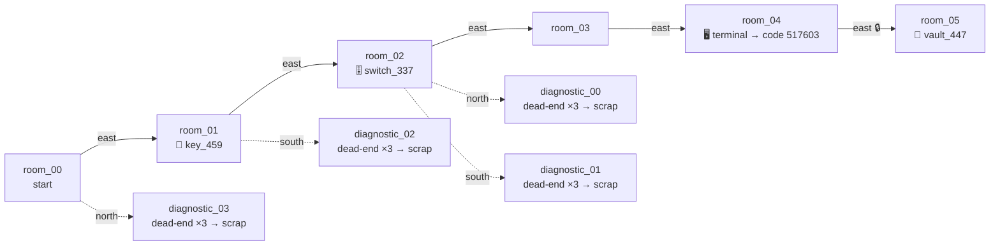
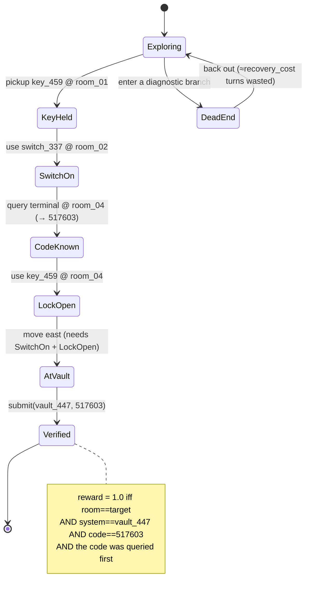

# Symbolic tool-calling environment — sample task

A real medium task from the eval set: `stc-56c8893db64c3c6c`
(depth 5, `distractor_ratio=0.4`, `recovery_cost=3`, optimal plan length 10).

## World map

Solid arrows are the solution corridor; dashed arrows are dead-end distractor
branches the agent must recognize and back out of.

## Solve state-machine

The reward is an exact function of hidden state, so the task *is* a state
machine — the agent drives it from `start` to `Verified` through an ordered set
of gates. The final east exit into the vault is locked until **both** the switch
is active **and** the key has released the lock, and a submission only verifies
if the code was actually queried from the terminal first.

## Tool interface

The policy acts through six tools over an OpenAI-compatible tool-calling API
(hermes parser); every response returns the complete visible state after the
action.

| tool | effect |
|---|---|
| `symbolic_inspect` | re-observe the current room (no state change) |
| `symbolic_move` | traverse an exit; fails if the exit is locked/absent |
| `symbolic_pickup` | take an object (e.g. the key) into inventory |
| `symbolic_use` | activate the switch, or use the key to release the vault lock |
| `symbolic_query` | read the access code from a terminal |
| `symbolic_submit` | submit `(system, code)`; terminal, exact-match verified |
