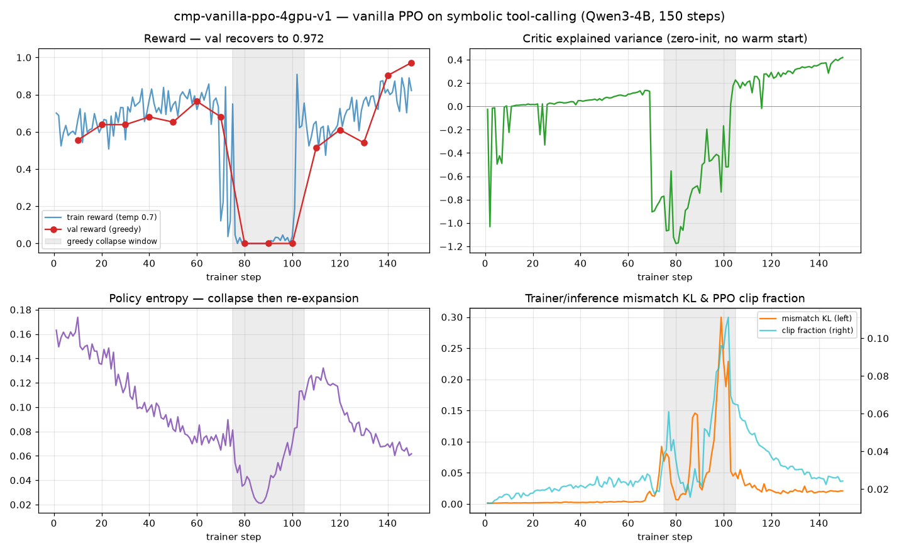
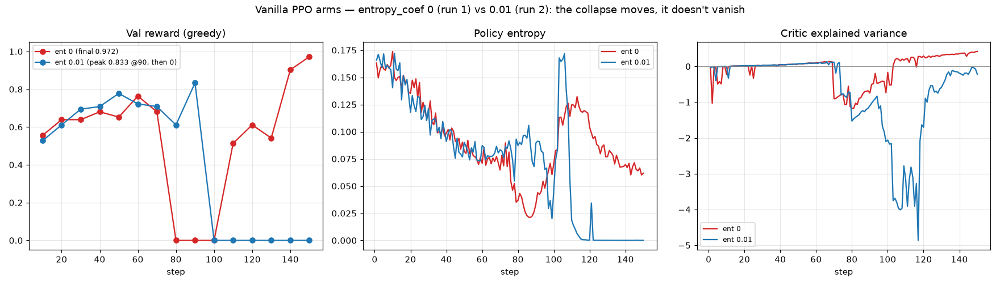

# Vanilla PPO on the symbolic compaction benchmark — run log

## What we are trying, in short

Chinmay's study ([blog.md](../../blog.md), HackMD) compared GRPO variants against
"compacted PPO" on the symbolic tool-calling env and concluded PPO loses badly
(hard-val pass@4: full GRPO 0.93 vs compacted PPO 0.25 cold / 0.14 warm-critic).
But his `compacted_ppo` is not real PPO — every compacted segment just gets the
rollout's final reward as a critic target: no GAE, no per-state advantages, and
the policy credit is literally compacted-GRPO credit.

**This experiment runs the missing baseline: actual vanilla PPO** (Schulman 2017)
— clipped surrogate + a learned value head + GAE advantages computed in the
trainer from a per-token reward stream — on the same environment, same model
(Qwen/Qwen3-4B-Instruct-2507), same regime as his Phase-A `cmp-*` runs
(batch 64, group 8, 150 steps, val every 10 steps, temp 0.7, 4096 completion
tokens). Full rollouts, no compaction. If real PPO also fails here, the blog's
"just normalize GRPO by segment count" takeaway gets much stronger; if it works,
the PPO half of the story needs rewriting.

Numbers to beat/compare (his Phase A, medium curriculum, from base model):
| Run | Train reward | Best val |
|---|---|---|
| cmp-full-grpo-v1 | 0.875 | **1.000** |
| cmp-compacted-grpo-v1 | 0.875 | 0.986 |
| cmp-segnorm-grpo-v1 | 0.900 | 0.986 |
| cmp-compacted-ppo-v1 | — (150 steps, no in-run val logged) | — |
| **cmp-vanilla-ppo-v1 (ours)** | ? | ? |

## Setup deltas vs his runs (honest differences)

- **Hardware**: 4× RTX PRO 6000 Blackwell Server Edition 96GB on Lium
  ($3.24/hr; his: 8× H100 80GB). Rebalanced to 2 inference / 2 trainer
  (FSDP-sharded) via the 4-GPU config. Slower wall-clock, same math.
- **Taskset**: his exact `symbolic-curriculum-v1` (624 train / 69 val) lives on
  his box and its curation depends on stochastic frozen-model rollouts, so we
  rebuilt it the same way as `symbolic-curriculum-v2`: deterministic candidate
  pools (seeds 4001 / 6001) → frozen Qwen3-4B pass@4 sweep on the pod →
  keep pass@4-mixed tasks (1–3 of 4 solved) → ~600 tasks, ~10% val split by
  task_id hash. Same distribution, not the identical task list.
- **Algorithm**: `ppo` (ours) — per-token terminal-reward stream from the
  orchestrator, trainer-side GAE (gamma=1.0, lambda=0.95), clipped surrogate
  (eps=0.2), clipped value loss (c1=0.5), no entropy bonus. Config:
  [rl_qwen3_instruct_cmp_vanilla_ppo.toml](../../rl_qwen3_instruct_cmp_vanilla_ppo.toml).

## Timeline

- **2026-07-12**: Merged Chinmay's latest `synth-env` (Phase-A/B code + results)
  into `feat/vanilla-ppo`; fixed the ppo⇔ppo-loss config validator to accept his
  `compacted_ppo`; all algorithm/PPO unit tests green. Created
  `cmp-vanilla-ppo-v1` config. H100s ruled out on cost; no multi-GPU A100s were
  available. First pod (8× RTX 6000 Ada) died to a Lium SSH-key provisioning
  bug; switched to 4× RTX PRO 6000 Blackwell 96GB ($3.24/hr) with the 4-GPU
  config (2 inference / 2 trainer).
- **2026-07-12, later**: Rebuilt the medium curriculum on the pod as
  `symbolic-curriculum-v2`: frozen-model pass@4 sweeps over the deterministic
  candidate pools (800 short/medium-verbose seed 4001 + 400 medium-low seed
  6001, 4 rollouts each) → mixed-task curation at full quota (330 short + 330
  medium) → **588 train / 72 val** (his: 624/69). Launched
  `cmp-vanilla-ppo-4gpu-v1` — live at
  https://wandb.ai/krishnapg2315/blog-rl/runs/5c4f977de99343c7b44edfe8d05fb5c0.

## Results

Run: [cmp-vanilla-ppo-4gpu-v1](https://wandb.ai/krishnapg2315/blog-rl/runs/5c4f977de99343c7b44edfe8d05fb5c0)

### Mid-run (step ~50 of 150)

**Vanilla PPO is learning.** Val reward (greedy, 72 held-out tasks):

| Step | 10 | 20 | 30 | 40 |
|---|---|---|---|---|
| Val reward | 0.556 | 0.639 | 0.639 | 0.681 |

Train reward 0.746 at step 50 (started ~0.55–0.70). Critic **explained
variance 0.012 → 0.070 and rising** — the value head is learning from
scratch off trainer-side GAE targets, where Chinmay's compacted-PPO cold
critic stayed ≤ 0.01 for all 70 steps (his warm-start reached +0.30 but the
policy still collapsed). Clip fraction ~2%, entropy 0.16 → 0.08 (policy
sharpening), mismatch KL ~0.002, grad norm ~0.3–0.5 — no instability.
Trainer: ~35 s/step at 77% MFU, 39 GiB peak of 97 GiB per GPU.

### Collapse at step ~80: greedy-mode tool-call corruption

Val reward: 0.556 (10) → 0.639 (20/30) → 0.681 (40) → 0.653 (50) → **0.764
(60)** → 0.681 (70) → **0.000 (80, 90, 100)**. From step 80 every greedy
eval ends after 2 turns with reward 0. The rollouts show why — the policy
emits corrupted tool calls under greedy decoding:

```
<tool_call>
{"name": "symbolic_move", "arguments": {"direction": "east"}}ysqli
</tool_call>
```

A junk token (`ysqli`) inside the tool-call block breaks the hermes parser →
no tool call extracted → episode terminates. At temp 0.7 (training) the junk
token only sometimes samples, so train rollouts still run 11–14 turns with
reward 0.6–0.9; at temp 0 it is the argmax, so val is 0. Classic vanilla-PPO
degeneration with `entropy_coef=0` and no KL-to-reference: entropy collapsed
0.16 → 0.08, a spurious token got reinforced, and trainer↔inference mismatch
KL exploded 0.002 → 0.19.

### Final: it recovered — 0.972 val at step 150

| Step | 10 | 20 | 30 | 40 | 50 | 60 | 70 | 80 | 90 | 100 | 110 | 120 | 130 | 140 | 150 |
|---|---|---|---|---|---|---|---|---|---|---|---|---|---|---|---|
| Val | .556 | .639 | .639 | .681 | .653 | .764 | .681 | .000 | .000 | .000 | .514 | .611 | .542 | .903 | **.972** |

The degenerate greedy mode (steps 80–100) **self-corrected**: temp-0.7
training rollouts kept sampling past the junk token, failures fed negative
advantages back into it, and by step 110 greedy evals worked again — then
climbed to **0.972 by step 150** with more efficient solutions (turns
14.3 → 11.8). Final train reward 0.822.

**Bottom line vs the study** (same regime, our rebuilt curriculum):

| Run | Best val |
|---|---|
| cmp-full-grpo-v1 (his) | 1.000 |
| cmp-compacted-grpo-v1 (his) | 0.986 |
| cmp-segnorm-grpo-v1 (his) | 0.986 |
| cmp-compacted-ppo-v1 (his) | — (collapsed; hard pass@4 0.25) |
| **cmp-vanilla-ppo-4gpu-v1 (ours)** | **0.972** |

Real vanilla PPO ≈ GRPO on this benchmark. The blog's "PPO loses badly"
result is an artifact of the compacted rollout-reward critic, not of PPO
itself. Cost of PPO here: a transient degeneracy window (steps 80–100,
entropy collapse → corrupted greedy tool calls) that GRPO didn't show —
motivation for the `entropy_coef=0.01` follow-up arm
(`rl_qwen3_instruct_cmp_vanilla_ppo_ent001.toml`).

Checkpoint: step-150 policy + trained value head pushed to
`Occupying-Mars/qwen3-4b-symbolic-vanilla-ppo-v1` on HF.



## Run 2 — entropy_coef = 0.01 (cmp-vanilla-ppo-ent001-v1)

Same config plus the PPO paper's entropy bonus. Two operational notes: the
fused LM head has **no backward through entropy** (crashed at step 1 —
fixed with `trainer.model.fused_lm_head_token_chunk_size = "disabled"`),
and the first crashed wandb run id is `ac9d6180`; the real run is
[fc57f926](https://wandb.ai/krishnapg2315/blog-rl/runs/fc57f9265a2d4ff8aaa80fabcc9058ab).

| Step | 10 | 20 | 30 | 40 | 50 | 60 | 70 | 80 | 90 | 100–150 |
|---|---|---|---|---|---|---|---|---|---|---|
| Val | .528 | .611 | .694 | .708 | .778 | .722 | .708 | .611 | **.833** | **.000** |

The entropy arm **sailed through run 1's collapse window** (0.833 at step 90,
the best pre-collapse val either arm reached) — then collapsed at ~100 and
**never recovered**: entropy thrashed to 0.17 and pinned at 1e-4, critic
explained variance dove to −5, and every eval from 100 to 150 was a 1-turn
zero. The final policy is dead in greedy mode.



**Combined story**: vanilla PPO on this benchmark learns as well as GRPO
(both arms out-climbed to 0.76–0.83 val while his compacted PPO never got
off the ground) but lives on a knife's edge around steps 80–120. A 0.01
entropy bonus *moves* the collapse (~20 steps later) and makes it *worse*
when it lands; it does not remove it. Run 1's "success" at 0.972 partly
reflects where training stopped relative to its collapse/recovery cycle.
The principled fix to try next is a KL-to-reference leash (what DeepSeekMath
GRPO has and this pure-Schulman objective lacks) rather than more entropy.

**Artifacts** (HF, public):
- [qwen3-4b-symbolic-vanilla-ppo-v1](https://huggingface.co/Occupying-Mars/qwen3-4b-symbolic-vanilla-ppo-v1) — run 1 step-150 policy (val 0.972) + value head
- [qwen3-4b-symbolic-vanilla-ppo-ent001-v1](https://huggingface.co/Occupying-Mars/qwen3-4b-symbolic-vanilla-ppo-ent001-v1) — run 2: step-90 pre-collapse peak (val 0.833) at root + step-120/step-150 collapse-forensic checkpoints + value heads
- [curriculum_v2/](curriculum_v2/) — the exact 588/72 train/val task files both runs used

Charts rendered from the wandb run history. Full-history correction to the
log-sampled account above: the collapse window (~75–105) hit **training
rewards too**, not just greedy eval — a full policy collapse with critic
explained variance diving to −1.2, entropy pinned at 0.02, and mismatch
KL/clip-fraction spikes — followed by a complete self-recovery: entropy
re-expanded, the critic re-converged (ending at **+0.4**, its best), and val
finished at 0.972.
